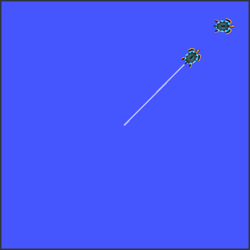

## ROS
  
**2.py** and **3.py** contain the required subscriber and publisher.  

**4_init.zsh** launches the turtlesim_node and spawns the required turtle.  
**4.py** directs the 'turtle1' to the required position.

