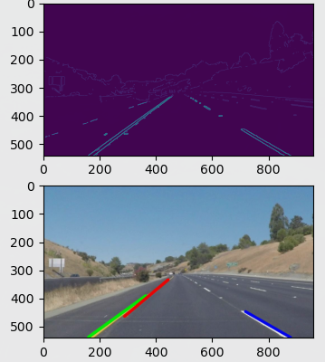

## Lane Detection Question

**detect.py:** This uses opencv implemented Canny Edge detection and Probabalistic Hough Transform with a mask to detect lane markers.  

**my_hough_implementation/:** This is my implementation of Edge detection, Hough Transform, and Hough Peak Finding to detect lane markers too. It has also been impemented in a way which can act on video streams.  

