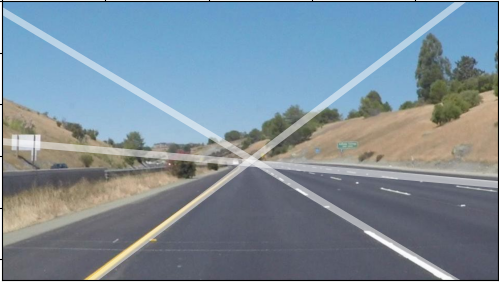

## This is an example of my implementation of Hough Transform.
  
**echo.py:** Superimposes detected lines on a video feed. (Main project)  
**image\_to\_lines.py:** Superimposes lines on a selected image. (Side Project)  
**lines.py:** A set of helper classes for peaking and applying transform.  

Example of image\_to\_lines.py:  

