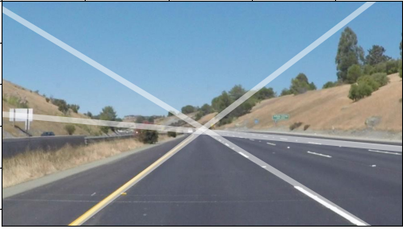

echo.py: Superimposes detected lines on a video feed. (Main project)
image_to_lines.py: Superimposes lines on a selected image. (Side Project)
lines.py: A set of helper classes for peaking and applying transform.

