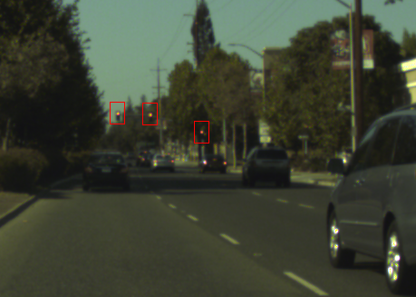
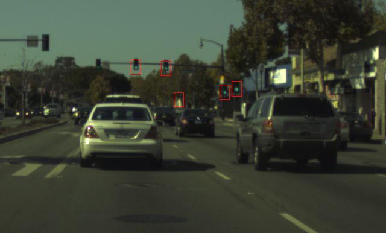
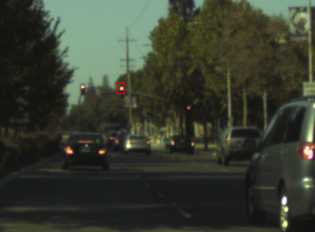
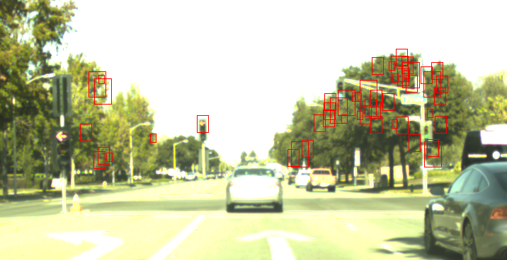
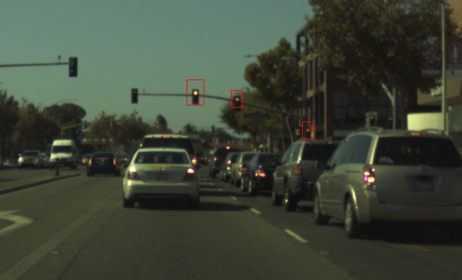

## Traffic light detection.  

My original plan was to label the data and give it to one of the popular Deep CNNs.   
However, there wasn't a lot of data to train on and I would have to manually label it (**old_approach/generate_answers.py**).  
I could get some external training data but i never went down that path.  

I ended up using color-detection.  
The current algorithm could use a lot of improvement:
- A tighter color range
- Hough circle detection for the contours
- Removing many densely packed contours. (or merging closely packed contours.)
  
    
 
 
 
 
 